# <h1 align="center"> Infraestrutura para Sistemas Web <h1>

## <h2 align="center">Projeto em Infraestrutura 2 - AVA_Moodle <h2>
 

  

  
  
Esse projeto consiste na instalação de um: Ambiente Virtual de Aprendizagem Existem vários sistemas AVA no mercado. Abordaremos o Moodle. 

  
Requisitos:
  
  
  1. Você deverá instalar e configurar o Moodle em sua infraestrutura;
  2. Além da instalação e configuração, você deverá redigir um relatório descrevendo o processo;
  3. O relatório deverá ser escrito em Markdown e postado no seu github.
 

  
  ## 1.__Instalação do Moodle no Ubuntu Server 20.04.__ <h2>  
  
  <h4>Pré-requisitos:</h4>
  
* __Criar um usuário sudo no seu servidor__: vamos realizar os passos neste guia usando um usuário não raiz com privilégios sudo. 
* __Instalar uma pilha LAMP:__ o Moodle precisará de um servidor Web, um banco de dados e um PHP para funcionar corretamente. Configurar uma pilha LAMP (Linux, Apache, MySQL, e PHP) cumpre todos esses requisitos. 

  
   ### 1.1. Instalar software adicional. <h3>
  
Para o Moodle funcionar como esperado, precisamos instalar pacotes de software extras usando o comando abaixo

 
 ~~~shell
sudo apt install graphviz aspell ghostscript clamav php7.4-pspell php7.4-curl php7.4-gd php7.4-intl php7.4-mysql php7.4-xml php7.4-xmlrpc php7.4-ldap php7.4-zip php7.4-soap php7.4-mbstring
 ~~~
 

> :warning:**Aviso!:** Se você usar <b>versões mais novas do MariaDB no Ubuntu 20.04</b>, essas alterações no arquivo de configuração surgirão e ocorrerão erros (mysql unknown variable 'innodb_file_format = barracuda'), portanto, comente ou <b>não faça essas alterações</b>, esses valores são obtidos por padrão. em MariaDB 10.2 e removido em MariaDB.  
  ### 1.2. Configurar o arquivo MySql padrão (Caso esteja fazendo em versões anteriores ao Ubuntu Server 20.04). <h3>

Agora precisamos fazer algumas modificações no arquivo de configuração mysql padrão. Usando seu editor de texto preferido, abra o arquivo abaixo.

~~~shell
sudo nano /etc/mysql/mysql.conf.d/mysqld.cnf
~~~

Na seção Mysqld , anexe as linhas abaixo:

~~~shell
default_storage_engine = innodb
innodb_file_per_table = 1
innodb_file_format = Barracuda
innodb_large_prefix = 1
~~~

Depois de acrescentar essas linhas, reinicie o banco de dados MySQL para efetuar as alterações

~~~shell
sudo service apache2 restart
~~~

  ### 1.3. Criar o banco de dados Moodle e o usuário Moodle MySQL com as permissões corretas. <h3>

 Para começar, faça login na conta raiz (administrativa) do MySQL, inserindo este comando:

~~~shell
sudo mysql -u root -p
~~~

Será solicitada a senha que você configurou para a conta raiz do MySQL quando instalou o software.

 Primeiramente, criamos um banco de dados separado que o moodle irá controlar. Você pode dar o nome que quiser ao banco de dados, mas neste guia nós o chamaremos de moodle para ficar mais simples. Crie o banco de dados para o Moodle digitando:

~~~mysql
CREATE DATABASE moodle DEFAULT CHARACTER SET utf8mb4 COLLATE utf8mb4_unicode_ci;
~~~

Em seguida, vamos criar uma conta de usuário do MySQL separada que vamos usar exclusivamente para operar no nosso novo banco de dados. 

>:information_source: __Nota:__ Criar bancos de dados e contas para uma função é uma boa ideia sob o ponto de vista de gerenciamento e segurança. 

 Vamos usar o nome <b>moodleuser</b> neste guia. Sinta-se à vontade para alterar isso se quiser.

 Vamos criar essa conta, definir uma senha e conceder o acesso ao banco de dados que criamos. Podemos fazer isso digitando o seguinte comando: Lembre-se de escolher uma senha forte para o usuário do seu banco de dados:

~~~mysql
CREATE USER 'moodleuser'@'localhost' IDENTIFIED BY 'suasenha';
~~~

~~~mysql
GRANT ALL PRIVILEGES ON *.* TO 'moodleuser'@'localhost' WITH GRANT OPTION;
~~~

Agora, você tem um banco de dados e uma conta de usuário, criados especificamente para o moodle. Precisamos atualizar os privilégios para que a instância atual do MySQL saiba sobre as alterações recentes que fizemos:

~~~mysql
FLUSH PRIVILEGES;
~~~

Feito isso é só sair do banco usando o comando exit.

  ### 1.4. Instalação do Moodle. <h4>

Faça o download da última versão do moodle em www.moodle.org no link [Downloads Moodle](http://download.moodle.org/)

A versão mais recente do moodle usando no presente tutorial foi a 3.10+

Baixe o arquivo, no diretório /var/www , usando o código abaixo

~~~shell
cd /var/www
~~~

~~~shell
sudo wget https://download.moodle.org/download.php/stable310/moodle-3.10.tgz
~~~

Depois de baixar o arquivo, descompacte usando o comando:

~~~shell
sudo tar xvfz moodle-latest-310.tgz
~~~
  

Se for outra versão, o nome pode ser diferente

Agora para terminar a instalação do moodle vamos precisar usar um navegar web

Em seu navegador padrão digite na url:

~~~http
http://seu_ip_localhost/moodle
~~~

Isso abrirá a página de instalação do moodle pela web que oferece a opção de selecionar seu idioma. Selecione seu idioma preferido e clique em 'Próximo'.

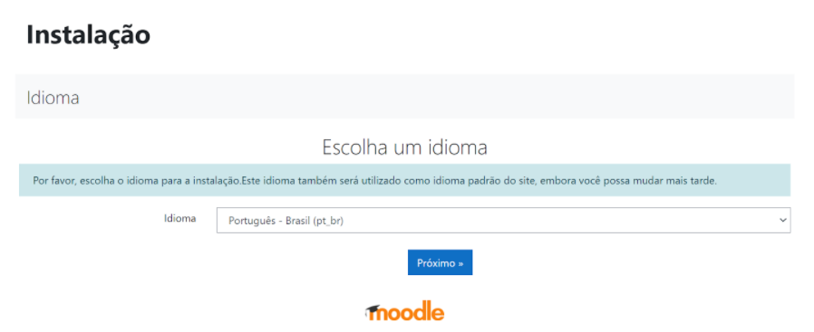

A próxima página, será onde você verificará o caminho para o diretório moodle e o armazenamento de dados. Clique em 'Next'

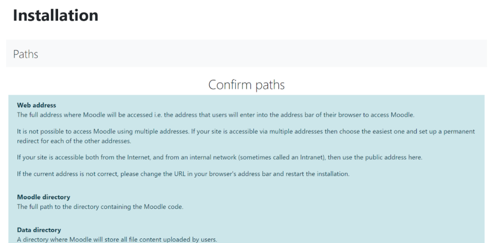

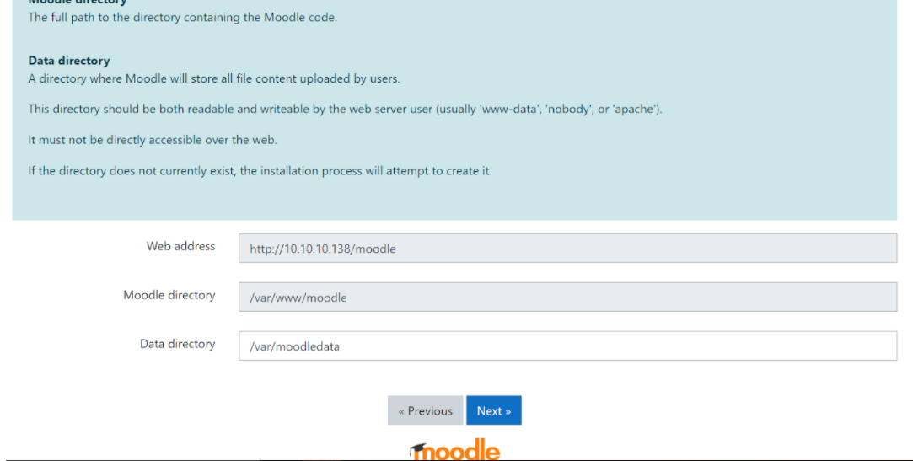
  

Nessa parte, caso o endereço seja diferente é necessário alterá-lo no campo endereço web O moodle também mostra nesta tela o diretório onde será instalado que no nosso caso é o diretório /var/www/moodle

>:information_source: __Nota:__ Antes de ir para a próxima página, faça essas configurações abaixo:

Crie o Diretório  /var/moodledata usando o comando:

~~~shell
mkdir /var/moodledata
~~~

É necessário também conceder ao diretório moodledata todos os privilégios de acesso usando o comando:

~~~shell
chmod 777 moodledata
~~~

Feita isso, é necessário restartar o apache com o comando:

  
~~~shell
/etc/init.d/apache2 restart
~~~

Atualize esta página da Web (F5) E clique no botão "Next" 

Nesta página você deixa como padrão o Mysql nativo do moodle e só aperte o botão "Next" 

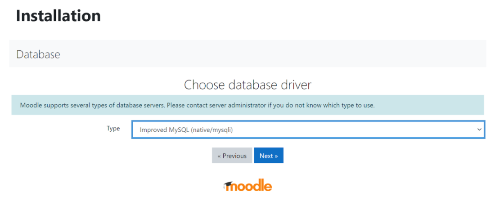

Nesta tela de configuração do banco de dados devemos informar:

* Servidor hospedeiro do banco de dados: localhost
* Nome do banco de dados: moodle
* Usuário do banco: moodle
* Senha do banco: moodle

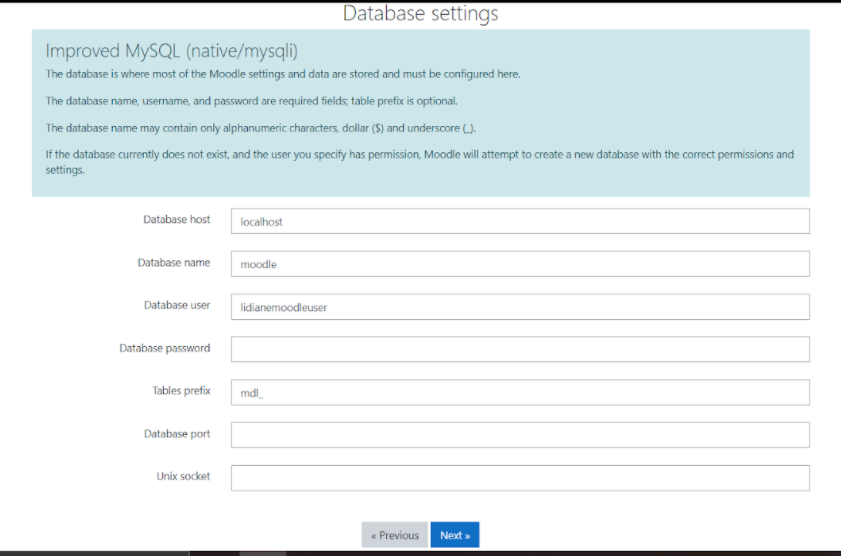

Depois de fazer as configurações do banco de dados, a tela seguinte irá mostar um aviso de direitos autorais, é só clicar no botão "Next".  

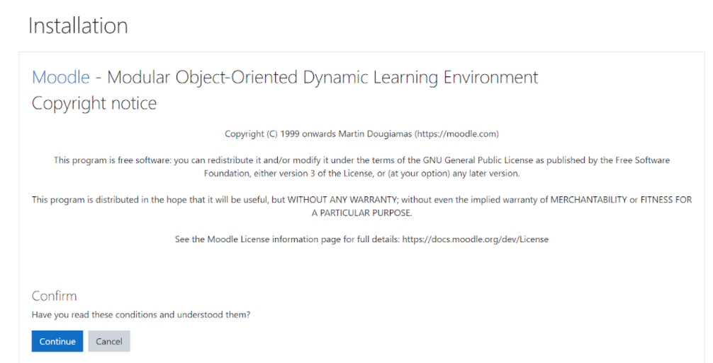

>:information_source: __Nota:__  __Antes de ir para a próxima página, faça essas configurações abaixo:__

Como root acesse o terminal e faça os seguintes comandos:

Entre no diretório cd /var/www/moodle

~~~shell
cd /var/www/moodle
~~~

~~~shell
cp config-dist.php config.php
~~~

~~~shell
chmod 777 config.php
~~~

Feito isso, abra o arquivo config.php com o seu editor favorito, por exemplo: nano, vim ... 

 Verifique as seguintes linhas:

~~~shell
$CFG->dbtype = 'mysql'; // mysql or postgres7 (por enquanto)
$CFG->dbhost = 'localhost'; // por exemplo: localhost ou db.isp.com
$CFG->dbname = 'moodle'; // nome do banco de dados, por exemplo, moodle
$CFG->dbuser = 'moodle'; // nome de usuário do seu banco de dados
$CFG->dbpass = 'moodle'; // sua senha de banco de dados
$CFG->prefix = 'mdl_'; // Prefixo a ser usado para todos os nomes de tabela
Verifique a linha $CFG->wwwroot = 'http://seu_ip_localhost/moodle';
Verifique a linha $CFG->dirroot = '/var/www/moodle';
Verifique a linha $CFG->dataroot = '/var/moodledata';
~~~

<b>Elas devem estar exatamente deste jeito</b>

Salve e feche o arquivo config.php

Agora sim, depois de fazer essas alterações, clique em botão "Next" 

O moodle fará outra verredura no sistema para verificar se o ambiente é compatível ou não, a tela será igual a imagem abaixo:

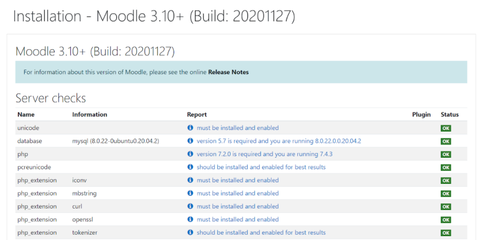

E se todos os requisitos forem atendidos, clique em 'Continuar'

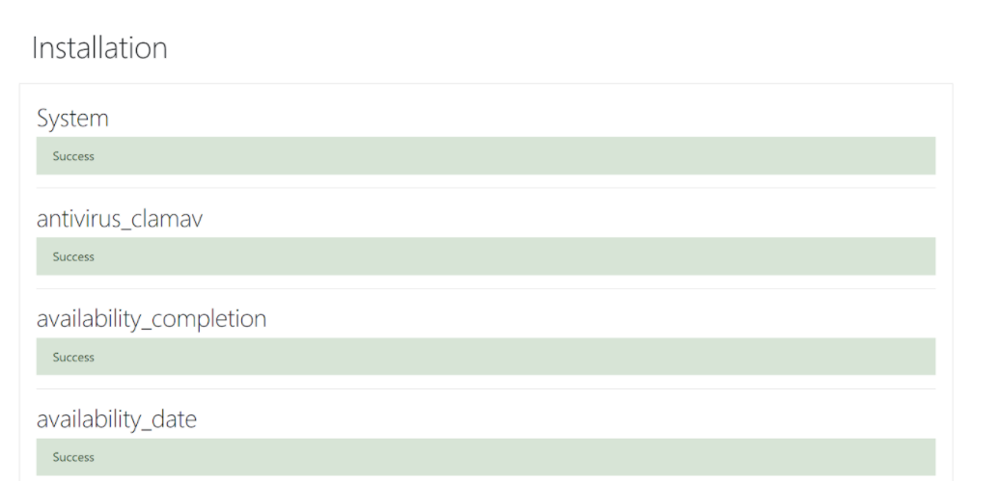

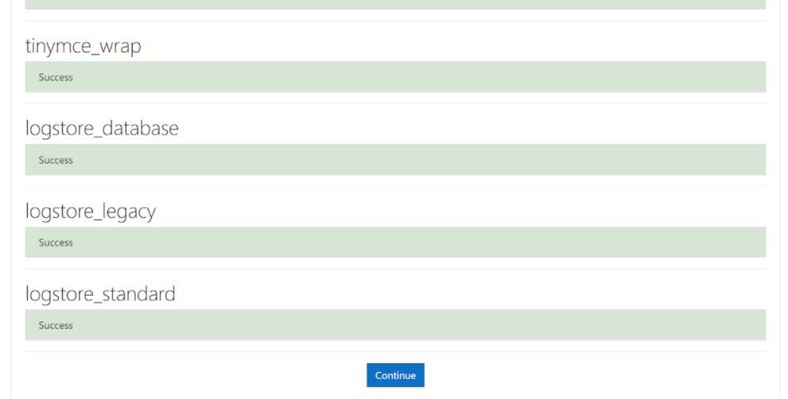

Se tudo der certo, a próxima página será onde você preencherá os detalhes do usuário administrador

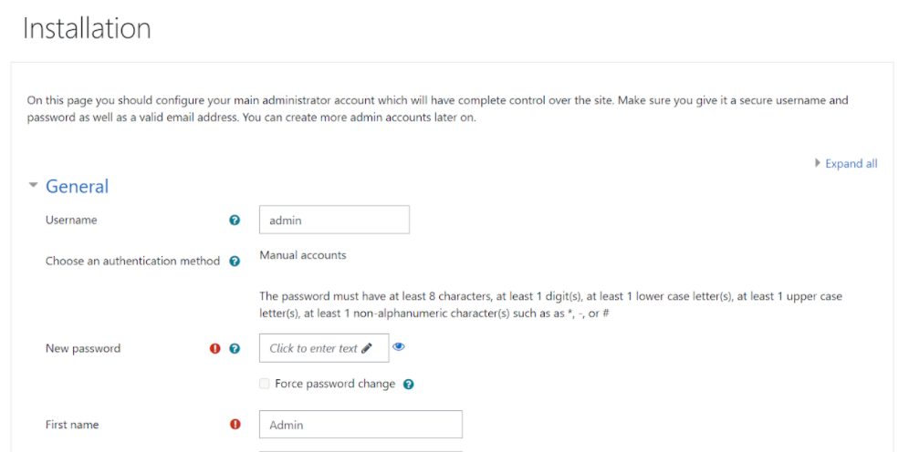

Depois de preencher essas informações, salve as alterações.

PRONTO! O MOODLE ESTÁ PRONTO PARA SER UTILIZADO.

Agora você será redirecionado para página do moodle, igual a imagem abaixo:

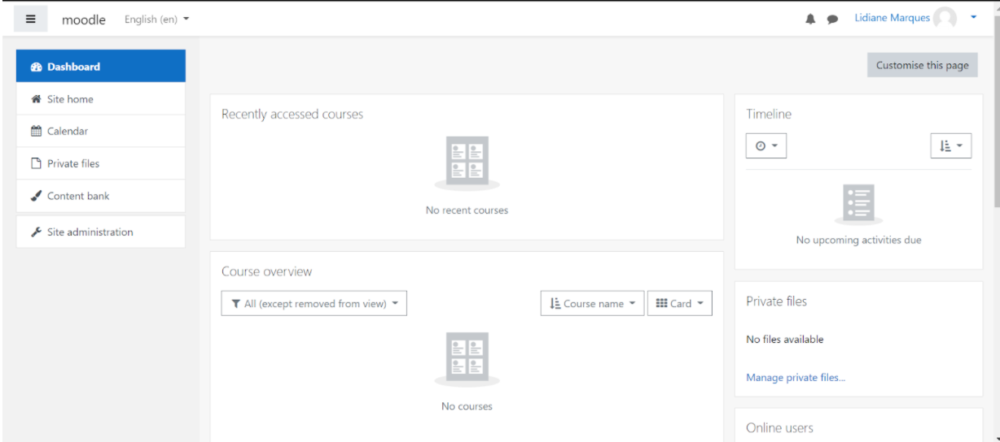

 

 

## Referências

[Instalação do Moodle](https://docs.moodle.org/all/pt_br/Instala%C3%A7%C3%A3o_do_Moodle_no_Ubuntu)

[Step-by-step Installation Guide for Ubuntu](https://docs.moodle.org/310/en/Step-by-step_Installation_Guide_for_Ubuntu)

[How To Install Moodle On Ubuntu 18.04](https://cloudcone.com/docs/article/how-to-install-moodle-on-ubuntu-18-04/)

  

